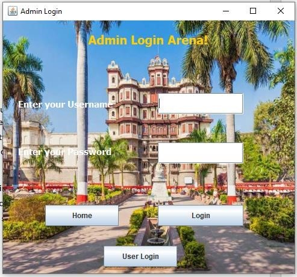
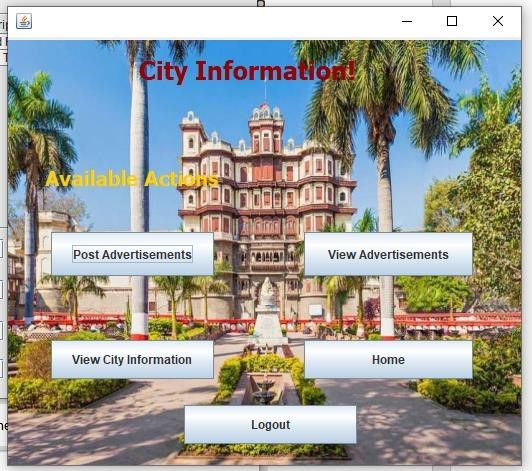

# City Classified and Search Project
<b><u>Objective</b></u> 
Here, users can post and view the classified after getting logged in and search details of the city such as shopping malls, colleges, schools, hospitals etc. 

<b>Users of system</b> 
<ul><li>Admin</li><li>Posters and Seekers/Viewers</li></ul>
<b>Functional Requirements</b> 
<ul><li>Admin</li>
1.	Can post information on various subjects such as shopping malls, colleges, schools, hospitals etc. after getting logged in!  
2.	Can post Classifieds of that city with contact details.   
3.	Can delete all information which is previously posted.   
 
<li>Posters and Seekers/Viewers</li>
1.	Can post classifieds after getting logged in!  
2.	Can View classifieds. In such case, login is not required.  
3.	an get details about the city such as shopping malls, colleges, schools, hospitals etc.  
</ul>
<b>Tools Used</b> 
1.	Eclipse IDE  
2.	MySQL Database   
<b>Working of Project with Screenshots</b> 
 
This is the home page of the application. Admins and users can login using the given buttons and they can view the advertisements without logging in.   
 
This is the admin login page, entering the correct credentials will open the admin pane  
 
These are the actions that admin can perform. Admin can post/edit the information about the city, post advertisements or can logout or can go back to the home page by pressing ‘Home’ button.  
 
City information will be displayed in the table and admin can add/delete info.  
 
 
These messages will be displayed after performing the add/delete action. Pressing ‘Back’ button will take the admin back to the admin panel page.   

 
‘Post Advertisement’ will open this frame where admin can post advertisements.    
 
This message will be displayed on posting the advertisement.   
 
This is user login arena, on entering correct login credentials, user panel will open.   
 
These are the available actions.  
 
‘Post Advertisement’ will open this window where the user can post advertisements.   
 
User can also view all advertisements by clicking ‘View Advertisements’ button, this button is also available on the home page so that anyone can view advertisements without logging in.  
 
‘City Information’ button will display this table. User can go back to the user panel by pressing ‘Back’ button or can go to the home page by clicking ‘Goto Home button’. 
Pressing logout button will take the user back to the homepage. 
This is the working of the application.  
<b>Class Diagram</b> 
 
<b>Activity Diagram</b> 
 
<b>ER Diagram</b> 
 
<b>Flow Diagram</b> 
 
